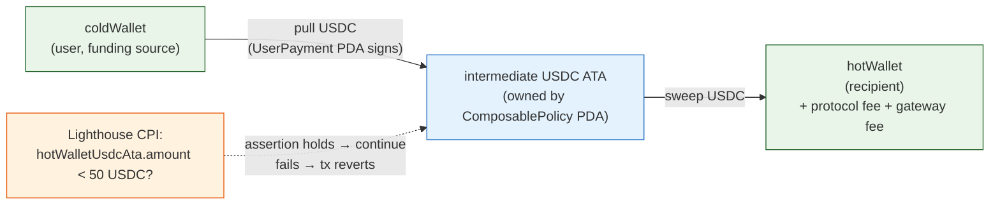

# Example: Auto-Topup Guard

**Use case.** A hot wallet (the recipient) must stay above a USDC threshold so
its operator can keep paying gas, refilling positions, etc. A cold wallet (the
user) funds the topup. The topup should only fire when the hot wallet's USDC
balance drops **below** the threshold — not on a fixed schedule.

This is a composable policy with:

- **Validation enabled** — Lighthouse asserts `hotWalletUsdcAta.amount < threshold`.
- **Forward disabled** — same-mint (USDC → USDC) pull → sweep. No swap needed.



## Prerequisites

- A `UserPayment` PDA for `coldWallet` + `USDC_MINT`. The cold wallet must
  approve the `UserPayment` PDA as delegate on its USDC ATA with sufficient
  `delegated_amount`.
- A `PaymentGateway` with a signer (the executor).
- An SPL token account for `hotWallet` in USDC — Lighthouse will read it.

```typescript
import * as anchor from "@coral-xyz/anchor";
import {
  PublicKey,
  SystemProgram,
  Transaction,
  sendAndConfirmTransaction,
} from "@solana/web3.js";
import { getAssociatedTokenAddressSync } from "@solana/spl-token";
import {
  Tributary,
  lighthouse,
  LIGHTHOUSE_PROGRAM_ID,
} from "@tributary-so/sdk";
import { Buffer } from "buffer";

const THRESHOLD = 50_000_000; // 50 USDC (6 decimals)
const TOPUP_CHUNK = 50_000_000; // 50 USDC per execute call

const USDC_MINT = new PublicKey("EPjFWdd5AufqSSqeM2qN1xzybapC8G4wEGGkZwyTDt1v");
const hotWalletUsdcAta = getAssociatedTokenAddressSync(
  USDC_MINT,
  hotWallet.publicKey
);
```

## 1. Build the Lighthouse assertion

```typescript
const guard = lighthouse
  .tokenAccount(hotWalletUsdcAta)
  .amount(THRESHOLD, "<")
  .build();

// guard.data         → Buffer (the serialized Lighthouse instruction data)
// guard.numAccounts  → 1
// guard.accounts     → [{ pubkey: hotWalletUsdcAta, isSigner: false, isWritable: false }]
```

## 2. Create the composable policy

Forward disabled: `targetProgram = PublicKey.default()`. Because there's no
swap step, `num_data_checks` must be `0` and `input_mint === output_mint`.

```typescript
const policyType = {
  payAsYouGo: {
    maxAmountPerPeriod: new anchor.BN(100_000_000), // 100 USDC / month cap
    maxChunkAmount: new anchor.BN(TOPUP_CHUNK), // 50 USDC / call
    periodLengthSeconds: new anchor.BN(30 * 24 * 3600),
    currentPeriodStart: new anchor.BN(Math.floor(Date.now() / 1000)),
    currentPeriodTotal: new BN(0),
    padding: new Array(88).fill(0),
  },
};

const forwardConfig = {
  targetProgram: PublicKey.default(), // sentinel → forward disabled
  inputMint: USDC_MINT,
  outputMint: USDC_MINT, // must equal inputMint when disabled
  minOutputAmount: null,
  forwardFlags: 0,
  numDataChecks: 0,
  dataChecks: [
    { offset: 0, length: 0, expected: [0, 0, 0, 0, 0, 0, 0, 0] },
    { offset: 0, length: 0, expected: [0, 0, 0, 0, 0, 0, 0, 0] },
    { offset: 0, length: 0, expected: [0, 0, 0, 0, 0, 0, 0, 0] },
    { offset: 0, length: 0, expected: [0, 0, 0, 0, 0, 0, 0, 0] },
  ],
};

const createIx = await sdk.getCreateComposablePolicyInstruction(
  USDC_MINT,
  hotWallet.publicKey, // recipient
  gatewayPDA,
  policyType,
  "Auto topup guard",
  forwardConfig,
  LIGHTHOUSE_PROGRAM_ID, // validation program (SystemProgram = none)
  guard.numAccounts, // 1
  guard.data
);

await sendAndConfirmTransaction(
  connection,
  new Transaction().add(createIx),
  [hotWallet, coldWallet], // recipient is the fee_payer, user must sign too
  { commitment: "processed" }
);
```

!!! info "Why PayAsYouGo?"
A `PayAsYouGo` policy caps both per-call (`max_chunk_amount`) and per-period
(`max_amount_per_period`) spend. For topup logic you typically want the topup
to fire only when needed (Lighthouse gate) and to stop once the period budget
is exhausted — exactly the PayAsYouGo semantics.

## 3. Execute (permissionless)

The executor is any gateway signer (or the user / recipient). Forward disabled
→ `instructionData` is unused; pass an empty buffer. `remaining_accounts` =
the Lighthouse read-accounts (`guard.accounts`). The SDK auto-prepends the
`ValidationPda`.

```typescript
const composablePolicyPDA = getComposablePolicyPda(
  userPaymentPDA,
  composablePolicyId,
  programId
).address;

const execIx = await sdk.executeComposable(
  composablePolicyPDA,
  Buffer.alloc(0), // forward disabled
  new anchor.BN(TOPUP_CHUNK),
  guard.accounts // the SDK prepends the ValidationPda; you only pass the read-accounts
);

await sendAndConfirmTransaction(
  connection,
  new Transaction().add(execIx),
  [coldWallet],
  { commitment: "processed" }
);
```

## What happens on-chain

1. **Pull** — `UserPayment` PDA signs a `transfer` from `coldWalletUsdcAta`
   into the `intermediate_input_ata` (owned by the `ComposablePolicy` PDA).
2. **Validate** — Tributary CPIs Lighthouse with `guard.data` +
   `[hotWalletUsdcAta]` as read-accounts. Lighthouse asserts
   `hotWalletUsdcAta.amount < 50 USDC`. If the hot wallet is already at or
   above the threshold, the assertion fails and the **whole transaction
   reverts** — no funds move.
3. **Settle** — Because forward is disabled, the program sweeps the
   intermediate USDC directly to `hotWalletUsdcAta` (minus the protocol fee +
   gateway fee). `min_output_amount` is checked against the **net** amount.

## Failure modes

| Condition                                                                                | Outcome                                                        |
| ---------------------------------------------------------------------------------------- | -------------------------------------------------------------- |
| `hotWalletUsdcAta.amount >= threshold`                                                   | Lighthouse assertion fails → tx reverts, nothing moves.        |
| PayAsYouGo period cap exhausted (`current_period_total + chunk > max_amount_per_period`) | `validate_policy_execution` rejects before the Lighthouse CPI. |
| Insufficient delegate amount on `coldWalletUsdcAta`                                      | Pull fails with `InsufficientDelegatedAmount`.                 |
| `ProgramConfig.emergency_pause == true`                                                  | `execute_composable` fails with `ProgramPaused`.               |

## Reference

- Working test: `tests/topup-balance.test.ts` (runs against Surfpool).
- [Lighthouse facade](../lighthouse-facade.md) — every assertion family.
- [SDK surface](../sdk.md) — `getCreateComposablePolicyInstruction` /
  `executeComposable` signatures.
