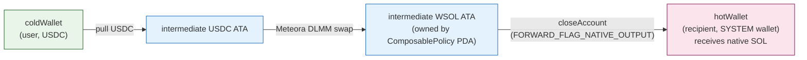

# Example: Native SOL Topup (WSOL → SOL unwrap)

**Use case.** Same as [Swap & Deliver](./swap-and-deliver.md), but the
recipient wants to be paid in **native SOL**, not wrapped SOL. Most recipient
wallets (exchanges, custody, treasuries) don't want to deal with unwrapping
WSOL themselves.

This is the swap-and-deliver flow plus one flag bit:
`ForwardConfig.forwardFlags & FORWARD_FLAG_NATIVE_OUTPUT`. When set, the
post-swap sweep does **not** `transfer_checked` into the recipient's WSOL ATA
— it `closeAccount`s the intermediate WSOL ATA directly into the recipient's
**system wallet**, shipping the WSOL value as native SOL.



## The `FORWARD_FLAG_NATIVE_OUTPUT` bit

```rust
// programs/tributary/src/constants.rs
pub const FORWARD_FLAG_NATIVE_OUTPUT: u8 = 1; // bit 0
```

Constraints enforced on-chain (`validate_forward_config`):

- The flag REQUIRES `output_mint == NATIVE_MINT` (`So111…111`). Setting the
  flag with any other output mint is rejected at policy creation
  (`NativeOutputRequiresWsol`).
- The recipient's `recipient_token_account` passed at execute time MUST equal
  `composable_policy.recipient` (the system wallet), NOT a token account. The
  handler validates this explicitly because Anchor constraints can't be
  conditional.

The sweep implementation (`process_output_and_sweep`):

```text
normal mode:        transfer_checked(intermediate_output → recipient_ata, sweep_amount, decimals)
NATIVE_OUTPUT mode: closeAccount(intermediate_output → recipient_system_wallet)
```

`closeAccount` ships the entire remaining WSOL value (= `sweep_amount`) as
native SOL, plus the rent lamports of the closed ATA (a side-effect bonus to
the recipient). The `destination` is constrained on-chain to equal
`composable_policy.recipient`, so there is no drain vector.

## Full code example

```typescript
import * as anchor from "@coral-xyz/anchor";
import {
  PublicKey,
  SystemProgram,
  Transaction,
  TransactionInstruction,
  sendAndConfirmTransaction,
} from "@solana/web3.js";
import { NATIVE_MINT, getAssociatedTokenAddressSync } from "@solana/spl-token";
import DLMM from "@meteora-ag/dlmm";
import {
  Tributary,
  lighthouse,
  LIGHTHOUSE_PROGRAM_ID,
} from "@tributary-so/sdk";

const SWAP_INPUT_AMOUNT = 50_000_000; // 50 USDC
const USDC_MINT = new PublicKey("EPjFWdd5AufqSSqeM2qN1xzybapC8G4wEGGkZwyTDt1v");
const METEORA_DLMM_PUBKEY = new PublicKey(
  "LBUZKhRxPF3XUpBCjp4YzTKgLccjZhTSDM9YuVaPwxo"
);
const METEORA_DLMM_SOL_USDC_POOL = new PublicKey("<your pool address>");

// bit 0
const FORWARD_FLAG_NATIVE_OUTPUT = 1;
```

### 1. Build the swap ix (same as swap-and-deliver)

```typescript
const dlmmPool = await DLMM.create(connection, METEORA_DLMM_SOL_USDC_POOL, {
  cluster: "mainnet-beta",
  skipSolWrappingOperation: true,
});
const swapForY = USDC_MINT.equals(dlmmPool.tokenX.publicKey);
const binArrays = await dlmmPool.getBinArrayForSwap(swapForY);
const quote = dlmmPool.swapQuote(
  new anchor.BN(SWAP_INPUT_AMOUNT),
  swapForY,
  new anchor.BN(100),
  binArrays
);

async function buildSwapIx(user: PublicKey): Promise<TransactionInstruction> {
  const swapTx = await dlmmPool.swap({
    lbPair: METEORA_DLMM_SOL_USDC_POOL,
    inToken: USDC_MINT,
    outToken: NATIVE_MINT,
    inAmount: new anchor.BN(SWAP_INPUT_AMOUNT),
    minOutAmount: quote.minOutAmount,
    user,
    binArraysPubkey: quote.binArraysPubkey as PublicKey[],
  });
  const found = swapTx.instructions.find((i) =>
    i.programId.equals(METEORA_DLMM_PUBKEY)
  )!;
  const keys = found.keys.map((k) =>
    k.pubkey.equals(SystemProgram.programId)
      ? {
          pubkey: METEORA_DLMM_PUBKEY,
          isSigner: k.isSigner,
          isWritable: k.isWritable,
        }
      : k
  );
  return new TransactionInstruction({
    keys,
    programId: found.programId,
    data: found.data,
  });
}

const discriminator = Array.from(
  (await buildSwapIx(PublicKey.default)).data.slice(0, 8)
);
```

### 2. Create the policy with `FORWARD_FLAG_NATIVE_OUTPUT`

```typescript
const forwardConfig = {
  targetProgram: METEORA_DLMM_PUBKEY,
  inputMint: USDC_MINT,
  outputMint: NATIVE_MINT, // REQUIRED — NATIVE_OUTPUT requires WSOL output
  minOutputAmount: null,
  forwardFlags: FORWARD_FLAG_NATIVE_OUTPUT, // ← bit 0 set
  numDataChecks: 1,
  dataChecks: [
    { offset: 0, length: 8, expected: discriminator },
    { offset: 0, length: 0, expected: [0, 0, 0, 0, 0, 0, 0, 0] },
    { offset: 0, length: 0, expected: [0, 0, 0, 0, 0, 0, 0, 0] },
    { offset: 0, length: 0, expected: [0, 0, 0, 0, 0, 0, 0, 0] },
  ],
};

const createIx = await sdk.getCreateComposablePolicyInstruction(
  USDC_MINT,
  hotWallet.publicKey, // recipient — the SYSTEM wallet that will receive SOL
  gatewayPDA,
  policyType,
  "Native SOL topup",
  forwardConfig,
  LIGHTHOUSE_PROGRAM_ID,
  guard.numAccounts,
  guard.data
);
```

### 3. Execute — `recipient_token_account` is the system wallet

This is the key difference from the WSOL-delivery variant: the
`recipient_token_account` field in the `executeComposable` accounts struct is
the recipient's **system wallet** (`hotWallet.publicKey`), not a WSOL ATA.
The handler checks `recipient_token_account == composable_policy.recipient`
when `NATIVE_OUTPUT` is set.

!!! warning "Bypass the SDK's recipient-ATA derivation"
The SDK's `executeComposable()` auto-derives `recipientTokenAccount` as
`getAssociatedTokenAddressSync(outputMint, recipient)`. For `NATIVE_OUTPUT`
that derivation is wrong — it would hand `closeAccount` a WSOL ATA instead
of the system wallet. Two options: - Use the low-level `program.methods.executeComposable(...)` path and pass
`recipientTokenAccount: hotWallet.publicKey` directly (see the test
suite for the exact accounts struct). - Wrap `executeComposable()` and override the resolved account after the
fact.

Low-level path (matches `tests/` pattern):

```typescript
const swapIx = await buildSwapIx(composablePolicyPDA);
const forwardAccounts = swapIx.keys.map((k) => ({
  pubkey: k.pubkey,
  isSigner: false,
  isWritable: true,
}));

const remainingAccounts = [
  { pubkey: validationPDA, isSigner: false, isWritable: false },
  ...guard.accounts,
  ...forwardAccounts,
];

const ix = await program.methods
  .executeComposable(Buffer.from(swapIx.data), new anchor.BN(SWAP_INPUT_AMOUNT))
  .accountsStrict({
    feePayer: coldWallet.publicKey,
    paymentsDelegate: paymentsDelegatePDA,
    composablePolicy: composablePolicyPDA,
    userPayment: userPaymentPDA,
    gateway: gatewayPDA,
    config: configPDA,
    validationProgram: LIGHTHOUSE_PUBKEY,
    userTokenAccount: coldWalletUsdcAta,
    mint: USDC_MINT,
    outputMint: NATIVE_MINT,
    intermediateInputTokenAccount: getAssociatedTokenAddressSync(
      USDC_MINT,
      composablePolicyPDA,
      true
    ),
    intermediateOutputTokenAccount: getAssociatedTokenAddressSync(
      NATIVE_MINT,
      composablePolicyPDA,
      true
    ),
    recipientTokenAccount: hotWallet.publicKey, // ← SYSTEM WALLET, not ATA
    gatewayFeeAccount: feeRecipientWsolAta, // fees are still WSOL
    protocolFeeAccount: adminWsolAta,
    tokenProgram: TOKEN_PROGRAM_ID,
    associatedTokenProgram: ASSOCIATED_TOKEN_PROGRAM_ID,
    systemProgram: SystemProgram.programId,
  })
  .remainingAccounts(remainingAccounts)
  .instruction();
```

!!! info "Fees are still WSOL"
`gateway_fee_account` and `protocol_fee_account` are still WSOL ATAs — the
fee slice of the output is delivered via `transfer_checked`, only the
recipient's slice is unwrapped via `closeAccount`. Recipient WSOL ATA is
not required.

## When to use native SOL vs WSOL delivery

| Recipient wants                                                  | Use                                     | `forwardFlags`                   |
| ---------------------------------------------------------------- | --------------------------------------- | -------------------------------- |
| WSOL (will unwrap themselves, or is a Solana-native DeFi wallet) | [Swap & Deliver](./swap-and-deliver.md) | `0`                              |
| Native SOL (exchange, custody, EOA-style wallet)                 | **Native SOL topup**                    | `FORWARD_FLAG_NATIVE_OUTPUT` (1) |

Native SOL delivery costs one extra `closeAccount` CPI and skips the
recipient ATA requirement. WSOL delivery leaves the recipient with a wrapped
balance they must unwrap later (or keep for DeFi use).

## Failure modes

| Condition                                                         | Outcome                                                       |
| ----------------------------------------------------------------- | ------------------------------------------------------------- |
| `outputMint != NATIVE_MINT` while flag set                        | Rejected at creation (`NATIVE_OUTPUTRequiresWsolOutputMint`). |
| `recipientTokenAccount != composable_policy.recipient` at execute | `Unauthorized`.                                               |
| Swap selector doesn't match the pinned `ByteRangeCheck`           | Tx reverts.                                                   |
| Lighthouse assertion fails                                        | Tx reverts before the swap.                                   |

## Reference

- `FORWARD_FLAG_NATIVE_OUTPUT` → `programs/tributary/src/constants.rs:24`
- Sweep logic → `process_output_and_sweep` in
  `programs/tributary/src/instructions/composable/execute_composable.rs`
- [Swap & Deliver](./swap-and-deliver.md) — the WSOL-delivery variant.
- [SDK surface](../sdk.md) — `executeComposable` and the
  `recipient_token_account` override caveat.
