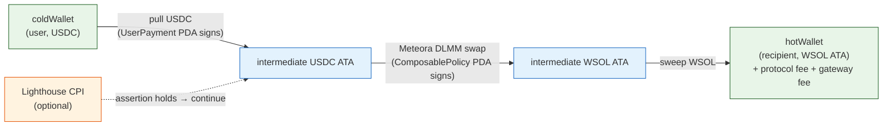

# Example: Swap & Deliver (USDC → WSOL via Meteora DLMM)

**Use case.** A service charges in USDC (the input mint the user holds), but
the recipient wants to be paid in WSOL. The composable policy pulls USDC from
the user, swaps it through a Meteora DLMM pool into WSOL, and delivers WSOL
(minus fees) to the recipient's WSOL ATA.

This is a composable policy with:

- **Forward enabled** — `targetProgram = METEORA_DLMM_PUBKEY`, with a
  `ByteRangeCheck` pinning the swap instruction discriminator at offset 0.
- **Optional validation** — same pattern as the topup guard (e.g. only swap
  when the recipient's WSOL balance is below a threshold).



## Constants

```typescript
import DLMM from "@meteora-ag/dlmm";
import { NATIVE_MINT } from "@solana/spl-token";

// The only program currently in ALLOWED_FORWARD_PROGRAMS.
const METEORA_DLMM_PUBKEY = new PublicKey(
  "LBUZKhRxPF3XUpBCjp4YzTKgLccjZhTSDM9YuVaPwxo"
);
const METEORA_DLMM_SOL_USDC_POOL = new PublicKey("<your pool address>");
const USDC_MINT = new PublicKey("EPjFWdd5AufqSSqeM2qN1xzybapC8G4wEGGkZwyTDt1v");
const SWAP_INPUT_AMOUNT = 50_000_000; // 50 USDC
```

!!! warning "Pool choice matters"
The pool you pass to `pool.swap()` must have `USDC_MINT` as one leg and
`NATIVE_MINT` as the other. Tributary does not validate the pool itself —
only that the `targetProgram` is allowlisted and the instruction selector
matches the pinned `ByteRangeCheck`.

## 1. Build the DLMM swap instruction

The swap `user` MUST be the `ComposablePolicy` PDA — it owns both intermediate
ATAs, and Tributary's `run_forward_cpi` promotes it to signer via
`invoke_signed`.

```typescript
// Load the pool with skipSolWrappingOperation — pool.swap() otherwise appends
// a WSOL wrap/unwrap post-instruction; Tributary manages the intermediates
// itself.
const dlmmPool = await DLMM.create(connection, METEORA_DLMM_SOL_USDC_POOL, {
  cluster: "mainnet-beta",
  skipSolWrappingOperation: true,
});

// swapForY = true ⟹ in-token is X (we sell USDC, buy WSOL/Y).
const swapForY = USDC_MINT.equals(dlmmPool.tokenX.publicKey);
const binArrays = await dlmmPool.getBinArrayForSwap(swapForY);
const quote = dlmmPool.swapQuote(
  new anchor.BN(SWAP_INPUT_AMOUNT),
  swapForY,
  new anchor.BN(100), // 1% slippage
  binArrays
);
```

The ComposablePolicy PDA isn't known until after creation, so build the swap
ix in two places: once at creation (to extract its discriminator) and again at
execute (with the real `user`). Wrap it in a helper:

```typescript
async function buildSwapIx(user: PublicKey): Promise<TransactionInstruction> {
  const swapTx = await dlmmPool.swap({
    lbPair: METEORA_DLMM_SOL_USDC_POOL,
    inToken: USDC_MINT,
    outToken: NATIVE_MINT,
    inAmount: new anchor.BN(SWAP_INPUT_AMOUNT),
    minOutAmount: quote.minOutAmount, // slippage protection at the swap layer
    user,
    binArraysPubkey: quote.binArraysPubkey as PublicKey[],
  });

  // pool.swap() returns [CU-estimation ix, idempotent ATA-create ix, swap ix].
  // Keep ONLY the instruction whose programId == DLMM.
  const found = swapTx.instructions.find((i) =>
    i.programId.equals(METEORA_DLMM_PUBKEY)
  );
  if (!found) throw new Error("DLMM swap instruction not found");

  // hostFeeIn fix: the SDK passes hostFeeIn: null → Anchor serializes that as
  // the System Program id. The DLMM program rejects a System-Program-owned
  // host_fee_in. Rewrite that one account meta to the DLMM program id itself
  // (Meteora's own CLI/tests use that as the "no host fee" placeholder).
  const keys = found.keys.map((k) =>
    k.pubkey.equals(SystemProgram.programId)
      ? {
          pubkey: METEORA_DLMM_PUBKEY,
          isSigner: k.isSigner,
          isWritable: k.isWritable,
        }
      : k
  );
  return new TransactionInstruction({
    keys,
    programId: found.programId,
    data: found.data,
  });
}

// Build once just to extract the discriminator for the ByteRangeCheck.
const discriminator = Array.from(
  (await buildSwapIx(PublicKey.default)).data.slice(0, 8)
);
```

## 2. Create the composable policy

Forward enabled: `targetProgram = METEORA_DLMM_PUBKEY`, at least one
`ByteRangeCheck` pins the discriminator at offset 0.

```typescript
const forwardConfig = {
  targetProgram: METEORA_DLMM_PUBKEY,
  inputMint: USDC_MINT,
  outputMint: NATIVE_MINT,
  minOutputAmount: null, // we let pool.swapQuote handle slippage at the swap layer
  forwardFlags: 0, // WSOL ATA delivery — see native-sol-topup.md for the unwrap variant
  numDataChecks: 1,
  dataChecks: [
    { offset: 0, length: 8, expected: discriminator }, // pin the swap selector
    { offset: 0, length: 0, expected: [0, 0, 0, 0, 0, 0, 0, 0] },
    { offset: 0, length: 0, expected: [0, 0, 0, 0, 0, 0, 0, 0] },
    { offset: 0, length: 0, expected: [0, 0, 0, 0, 0, 0, 0, 0] },
  ],
};

// Optional Lighthouse guard: only swap when recipient WSOL is below 1 WSOL.
const guard = lighthouse
  .tokenAccount(hotWalletWsolAta)
  .amount(1_000_000_000, "<")
  .build();

const createIx = await sdk.getCreateComposablePolicyInstruction(
  USDC_MINT,
  hotWallet.publicKey, // recipient
  gatewayPDA,
  policyType,
  "Topup WSOL swap",
  forwardConfig,
  LIGHTHOUSE_PROGRAM_ID,
  guard.numAccounts,
  guard.data
);
```

!!! info "Why pin the discriminator?"
Without a `ByteRangeCheck` at offset 0, a malicious gateway could substitute
any instruction data at execute time — the program ID is allowlisted, but
DLMM exposes other instructions besides `swap`. Pinning the first 8 bytes
locks the swap selector and refuses any other instruction shape.

## 3. Execute (permissionless)

The caller supplies:

- `instructionData` = the raw DLMM swap ix data (the same bytes whose first 8
  must match the pinned `ByteRangeCheck`).
- `forwardAmount` = the USDC pull size.
- `remaining_accounts` = `[...guard.accounts, ...forwardAccounts]` — the SDK
  auto-prepends the `ValidationPda`.

```typescript
// Two distinct intermediates (input_mint != output_mint), both owned by the
// ComposablePolicy PDA. The swap draws USDC from the input ATA and sends
// WSOL to the output ATA; fees + sweep then move WSOL to the recipient.
const swapIx = await buildSwapIx(composablePolicyPDA);

const forwardAccounts = swapIx.keys.map((k) => ({
  pubkey: k.pubkey,
  isSigner: false,
  // Mark ALL forward accounts writable. The DLMM program mutates several
  // accounts that dlmm-sdk@0.7.7's IDL marks read-only (e.g.
  // bin_array_bitmap_extension, oracle). The runtime permits marking an
  // account writable even if the callee never writes it, so this is safe
  // and sidesteps the stale-IDL mutability mismatch.
  isWritable: true,
}));

const remainingAccounts = [
  ...guard.accounts, // validation read-accounts (the SDK prepends ValidationPda)
  ...forwardAccounts, // DLMM swap accounts (includes the self-listed DLMM program)
];

const execIx = await sdk.executeComposable(
  composablePolicyPDA,
  Buffer.from(swapIx.data),
  new anchor.BN(SWAP_INPUT_AMOUNT),
  remainingAccounts
);
```

## `min_output_amount` semantics

`minOutputAmount` on the `ForwardConfig` is checked against the **NET
(post-fee)** output — i.e. the amount that actually lands in the recipient's
ATA after the protocol fee (default 100 bps) and gateway fee are deducted.

```text
swap_output_amount
   ├── protocol_fee   = swap_output * effective_protocol_fee_bps / 10000  → ProgramConfig.fee_recipient
   ├── gateway_fee    = swap_output * gateway_fee_bps / 10000             → PaymentGateway.fee_recipient
   └── net (swept)                                              → recipient
                              ↑
                       min_output_amount compared against THIS
```

!!! info "Two slippage knobs" - **Swap-level** slippage: `minOutAmount` in `pool.swapQuote(...)` —
protects against the DLMM price moving within the swap itself. - **Net-level** slippage: `ForwardConfig.minOutputAmount` — protects
against the post-fee delivered amount being below an acceptable floor.

    The DLMM `minOutAmount` is the primary defence. The Tributary
    `minOutputAmount` is a backstop on the net amount; set it to `null` if the
    swap-level slippage already covers your requirements.

## Failure modes

| Condition                                                      | Outcome                                                                                  |
| -------------------------------------------------------------- | ---------------------------------------------------------------------------------------- |
| Swap selector doesn't match the pinned `ByteRangeCheck`        | `DiscriminatorCheckRequired` / `ByteRangeCheckFailed` → tx reverts.                      |
| PayAsYouGo period cap exhausted                                | Rejected before the swap CPI runs.                                                       |
| Lighthouse assertion fails (recipient already has enough WSOL) | Tx reverts before the swap.                                                              |
| Insufficient delegate amount on `userTokenAccount`             | `InsufficientDelegatedAmount`.                                                           |
| Pool moves adversarially between quote and execute             | `minOutAmount` in the swap ix (and `ForwardConfig.minOutputAmount` if set) protects you. |

## Reference

- Working test: `tests/topup-balance-swap.test.ts` (runs against Surfpool
  with a mainnet-forked DLMM pool).
- [SDK surface](../sdk.md) — `executeComposable` and `remaining_accounts`
  layout.
- Next: [Native SOL topup](./native-sol-topup.md) — same flow but unwraps WSOL
  to native SOL via the `FORWARD_FLAG_NATIVE_OUTPUT` bit.
