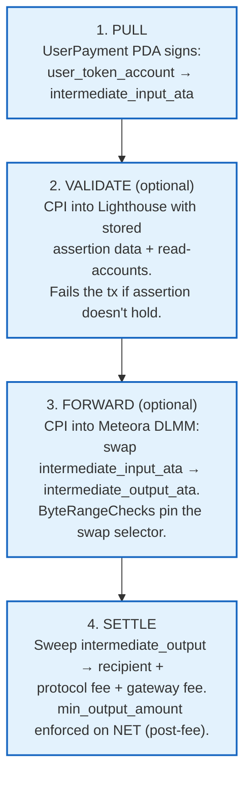

# Programmable Pull Payments

A **ComposablePolicy** is a pull payment that runs two optional hooks
**between** the pull and the settlement:

1. **Validation** — a read-only on-chain assertion (via Lighthouse) that can
   veto the transaction if a condition isn't met.
2. **Forward** — a token-transform step (via Meteora DLMM) that swaps the
   pulled input token into a different output token before delivery.

Both hooks are **opt-in via sentinel values**. A composable policy with both
disabled behaves like a `PaymentPolicy` but lives in its own PDA namespace and
routes through an intermediate ATA hop. Both families reuse the same
`PolicyType` enum (`Subscription` / `Milestone` / `PayAsYouGo`), the same
`UserPayment` account, and the same fee-distribution logic.

## The lifecycle: pull → validate → forward → settle

Key invariants enforced on-chain:

- **Intermediate ATAs are owned by the `ComposablePolicy` PDA**, not the
  `UserPayment` PDA. This decouples the intermediate signing authority from
  the user-source delegate — a forward program can only ever move transient
  intermediate balances, never the user's source funds.
- **Signer sanitization**: validation and forward CPI builders do NOT forward
  `is_signer` from `remaining_accounts`. The fee payer (a Signer) cannot be
  re-passed to grant Lighthouse / DLMM unintended signer authority.
- **Allowlists** (`programs/tributary/src/constants.rs`):
  - `ALLOWED_FORWARD_PROGRAMS` → Meteora DLMM
    (`LBUZKhRxPF3XUpBCjp4YzTKgLccjZhTSDM9YuVaPwxo`)
  - `ALLOWED_VALIDATION_PROGRAMS` → Lighthouse
    (`L2TExMFKdjpN9kozasaurPirfHy9P8sbXoAN1qA3S95`)
- **Emergency pause** (`ProgramConfig.emergency_pause`) blocks
  `execute_composable` just like `execute_payment`.

## The sentinel convention

| Hook you want to disable | Sentinel value                                        |
| ------------------------ | ----------------------------------------------------- |
| No validation            | `validation_program = SystemProgram.programId`        |
| No forward               | `forward_config.target_program = PublicKey.default()` |

The SDK accepts `validationProgram = PublicKey.default()` and rewrites it to
`SystemProgram.programId` internally (see `getCreateComposablePolicyInstruction`).
When forward is disabled, `num_data_checks` must be `0` and `input_mint` must
equal `output_mint` (no conversion step — it's a same-mint pull → sweep).

## When to choose ComposablePolicy vs PaymentPolicy

| Use case                                                         | Choose               | Reason                                                                                                                                                    |
| ---------------------------------------------------------------- | -------------------- | --------------------------------------------------------------------------------------------------------------------------------------------------------- |
| Plain subscription, milestone, or pay-as-you-go                  | **PaymentPolicy**    | One CPI: `transfer user → recipient + fees`. Cheapest, simplest.                                                                                          |
| Auto-topup a hot wallet when its balance drops below a threshold | **ComposablePolicy** | Needs a Lighthouse assertion to veto the pull when the balance is fine.                                                                                   |
| Pull USDC from user, deliver WSOL to recipient                   | **ComposablePolicy** | Needs a Meteora DLMM forward between the pull and the settle.                                                                                             |
| Pull tokens only if an oracle / on-chain state condition holds   | **ComposablePolicy** | Lighthouse can assert on any readable account (token account, mint, sysvar clock, raw account data).                                                      |
| "Pull X, deliver native SOL" (unwrap WSOL automatically)         | **ComposablePolicy** | Forward to WSOL + `FORWARD_FLAG_NATIVE_OUTPUT` bit → `closeAccount` ships SOL to the recipient's system wallet.                                           |
| Same-mint topup, no swap, no guard                               | **PaymentPolicy**    | A composable with both hooks disabled is functionally equivalent but pays the PDA-hop overhead. Use `PaymentPolicy` unless you need the extension points. |

## Where to next

- [SDK surface](./sdk.md) — `getCreateComposablePolicyInstruction`,
  `executeComposable`, `ForwardConfig`, `ValidationConfig`.
- [Lighthouse facade](./lighthouse-facade.md) — build assertions with
  `lighthouse.tokenAccount(ata).amount(threshold, "<").build()`.
- Examples: [Auto-topup guard](./examples/auto-topup-guard.md) ·
  [Swap & deliver](./examples/swap-and-deliver.md) ·
  [Native SOL topup](./examples/native-sol-topup.md).
- Deep technical reference → [Protocol Reference → Composable Policy](../../protocol-reference/composable-policy/overview.md).
