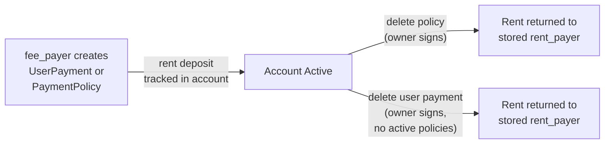

# Fees and Account Costs

Tributary has two cost dimensions: **payment fees** (deducted from each transfer) and **rent** (Solana's on-chain storage cost for accounts).

---

## Payment Fees

Every payment executed through Tributary splits the gross amount between the recipient, the gateway provider, and the protocol treasury.

| Fee Layer           | Default              | Range                           | Who Controls                      |
| ------------------- | -------------------- | ------------------------------- | --------------------------------- |
| Protocol fee        | 100 bps (1%)         | Fixed at program initialization | Protocol admin                    |
| Gateway fee         | Set per gateway      | 0–10,000 bps                    | Gateway authority                 |
| Custom protocol fee | Optional per gateway | 0–10,000 bps                    | Protocol admin (overrides global) |

### Fee Distribution

```
$100.00 Payment
├── $1.00 → Protocol Treasury (1% protocol fee)
├── $2.50 → Payment Gateway (2.5% gateway fee, provider-configurable)
│           └── of which referral rewards are allocated if enabled
└── $96.50 → Recipient
```

Fees are calculated as `(amount * bps) / 10000`, rounding down. Dust from rounding goes to the protocol treasury.

### Custom Protocol Fee

The protocol admin can override the global protocol fee on a per-gateway basis. This is useful for special arrangements (e.g., zero protocol fee for strategic partners). When enabled, the custom fee replaces the global 100 bps default — it does not stack.

```typescript
// Enable 0% protocol fee for a gateway (admin only)
await sdk.updateGatewayProtocolFee(gatewayAuthority, true, 0);
```

See [Providers](../operate/providers.md) for gateway configuration details.

### Referral Fee Allocation

When a gateway has the referral feature enabled, a portion of the gateway fee is allocated to referral rewards. The gateway authority configures:

- **Referral allocation**: Percentage of gateway fee dedicated to rewards (e.g., 500 bps = 5%)
- **Tier split**: How rewards distribute across up to 3 referral levels (must sum to 10,000 bps)

See [Referral Program](payment-policy/referral-program.md) for the full referral chain mechanics.

---

## Rent and Account Costs

Solana charges rent for on-chain data storage. Tributary creates several PDA accounts per user, each requiring a rent deposit. This section explains who pays, how much, and how rent is reclaimed.

### Who Pays Rent?

The `fee_payer` in the transaction covers the rent deposit at account creation time. Tributary tracks this `rent_payer` on-chain so that when the account is closed, the rent is returned to the original payer — not necessarily the account owner.

### Account Sizes and Costs

| Account           | Approx. Size | Rent Cost (SOL) | Created By            |
| ----------------- | ------------ | --------------- | --------------------- |
| `ProgramConfig`   | ~300 bytes   | ~0.002          | Protocol admin (once) |
| `PaymentGateway`  | ~350 bytes   | ~0.002          | Protocol admin        |
| `UserPayment`     | ~370 bytes   | ~0.0025         | Any fee payer         |
| `PaymentPolicy`   | ~630 bytes   | ~0.004          | Any fee payer         |
| `ReferralAccount` | ~150 bytes   | ~0.001          | Referrer              |

Actual costs vary with rent-exempt minimums. Accounts are rent-exempt at creation.

### Rent Lifecycle



#### Creation

When a `UserPayment` or `PaymentPolicy` is created, the `fee_payer` submits the rent deposit. The program stores `fee_payer` as `rent_payer` on the account:

```typescript
// SDK: user pays rent for their own UserPayment
const ix = await sdk.createUserPayment(tokenMint);
// rent_payer = user.publicKey (stored on-chain)
```

A third party (e.g., a payment gateway) can sponsor the rent by being the `fee_payer` in the transaction.

#### Deletion

When an account is closed, the stored `rent_payer` receives the lamports:

- **`delete_payment_policy`**: Owner signs, rent goes to `payment_policy.rent_payer`
- **`delete_user_payment`**: Owner signs, rent goes to `user_payment.rent_payer`. Requires `active_policies_count == 0`.

```typescript
// Delete all policies first
for (const policyId of policyIds) {
  await sdk.deletePaymentPolicy(tokenMint, policyId);
}

// Then delete the user payment account
// (only possible when activePoliciesCount === 0)
```

#### Backwards Compatibility

Accounts created before the `rent_payer` field was introduced have `rent_payer` set to `Pubkey::default()` (all zeros). In this case, the program falls back to returning rent to the `owner` (the signer of the delete transaction). This ensures no rent is lost on legacy accounts.

### Delegation Accounts

The `payments_delegate` PDA does not hold user funds — it's a program-derived authority for SPL Token transfers. No rent is associated with delegate approval; it's an SPL Token operation (`approve`) that costs only the transaction fee.

---

## Account Cleanup Flow

To fully remove a user from the protocol:

```
1. Delete all PaymentPolicy accounts (one per active subscription/milestone/PAYG)
   → Each returns rent to that policy's rent_payer
   → Decrements user_payment.active_policies_count

2. Delete UserPayment account
   → Requires active_policies_count == 0
   → Returns rent to user_payment.rent_payer
```

A user cannot delete their `UserPayment` while any `PaymentPolicy` still references it.

### Example: Full Cleanup via SDK

```typescript
const userPayment = await sdk.getUserPayment(userPaymentPDA);
const totalPolicies = userPayment.createdPoliciesCount;

// Delete all policies (skip already-deleted ones)
for (let id = 1; id <= totalPolicies; id++) {
  const [pda] = derivePolicyPda(userPaymentPda, id);
  if (await sdk.getPaymentPolicy(pda)) {
    await sdk.deletePaymentPolicy(tokenMint, id);
  }
}

// Now safe to delete the user payment
const { address: configPda } = sdk.getConfigPda();
const ix = await program.methods
  .deleteUserPayment()
  .accountsStrict({
    owner: user.publicKey,
    userPayment: userPaymentPda,
    tokenMint,
    rentPayer: user.publicKey,
    config: configPda,
  })
  .instruction();
```

---

## Transaction Costs

Beyond rent, every Tributary instruction incurs Solana's base transaction fee (currently 5,000 lamports per signature). Compute costs are minimal for standard operations.

| Operation             | Signatures | Est. Compute |
| --------------------- | ---------- | ------------ |
| Create user payment   | 1          | ~50k CU      |
| Create payment policy | 1          | ~80k CU      |
| Execute payment       | 1          | ~150k CU     |
| Delete payment policy | 1          | ~30k CU      |
| Delete user payment   | 1          | ~30k CU      |

CU estimates are conservative. Actual usage depends on policy type and referral chain depth.
