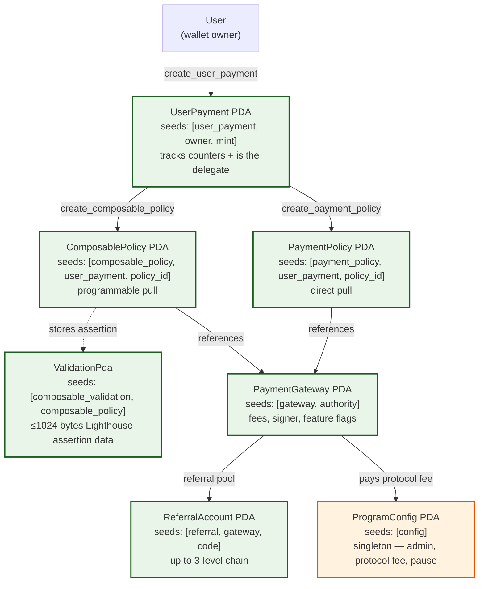

# Protocol Overview

Tributary is a non-custodial, pull-payment protocol on Solana. It lets a user
authorize a **gateway** to pull tokens from their wallet on a schedule, with
fees routed to the protocol, the gateway, and (optionally) a referral chain.
The user keeps custody the entire time — authorization is a scoped SPL token
delegation that the user can revoke at any moment.

The protocol exposes two policy families that share the same schedule model
but differ in execution semantics:

| Family               | What it does                                                                                                                                     | When to use                                                                                |
| -------------------- | ------------------------------------------------------------------------------------------------------------------------------------------------ | ------------------------------------------------------------------------------------------ |
| **PaymentPolicy**    | Direct pull: gateway transfers user → recipient + fees in one CPI.                                                                               | Subscriptions, milestones, pay-as-you-go without swaps.                                    |
| **ComposablePolicy** | Programmable pull with optional **validation** (Lighthouse assertion) and **forward** (Meteora DLMM swap) hooks between the pull and settlement. | Auto-topups, "pull USDC, deliver WSOL", gated payments that must pass on-chain conditions. |

Both reuse the same `PolicyType` enum (`Subscription` / `Milestone` /
`PayAsYouGo`), the same `UserPayment` account, the same fee-distribution
logic, and the same gateway/referral plumbing.

## Account relationships



For the full PDA seed table and per-account field layouts, see
[Accounts & PDAs](accounts-and-pdas.md).

## Execution lifecycle

```
1. SETUP (once per user/mint)
   ├── createUserPayment(owner, mint)        → UserPayment PDA
   ├── createPaymentGateway(authority, ...)  → PaymentGateway PDA   (gateway op)
   └── (optional) create_referral_account    → ReferralAccount PDA  (referrer)

2. POLICY CREATION
   ├── create_payment_policy    → PaymentPolicy PDA
   └── create_composable_policy → ComposablePolicy PDA  (+ ValidationPda)

3. DELEGATE APPROVAL  (user, off-chain or via SDK)
   └── spl-token approve <user_ata> <UserPayment PDA> <amount>

4. EXECUTION  (permissionless — any gateway signer)
   ├── execute_payment     → transfer user_ata → recipient + fees
   └── execute_composable  → pull → validate → forward → settle

5. ADVANCE / CLOSE
   ├── advance schedule (Subscription.next_payment_due, PAYG period reset)
   ├── pause / resume
   └── delete_*  → closes accounts, refunds rent to rent_payer
```

## The shared `PolicyType` enum

All three variants are fixed at **128 bytes** (plus a 1-byte enum
discriminator = 129 bytes total). This is a hard invariant: changing padding
breaks deserialization of every existing account.

| Variant          | Semantics                                                                                                                                                                                      |
| ---------------- | ---------------------------------------------------------------------------------------------------------------------------------------------------------------------------------------------- |
| **Subscription** | Fixed `amount` every `payment_frequency` until `max_renewals` reached (or forever if `auto_renew`). Gated by `next_payment_due`.                                                               |
| **Milestone**    | Up to 4 `(amount, timestamp)` milestones held in escrow. Released via `release_condition` bitmap: bit0=due-date, bits1–3 are mutually-exclusive signer requirements (gateway/owner/recipient). |
| **PayAsYouGo**   | Usage-based: claim up to `max_chunk_amount` per call, capped at `max_amount_per_period` per `period_length_seconds`. Period auto-resets.                                                       |

## Fee distribution flow

Every execution — `PaymentPolicy` or `ComposablePolicy` — splits the pulled
amount the same way:

```
pulled_amount
   ├── protocol_fee   = amount * effective_protocol_fee_bps / 10000   → ProgramConfig.fee_recipient
   ├── gateway_fee    = amount * gateway_fee_bps / 10000              → PaymentGateway.fee_recipient
   │      └── (if referral enabled) referral_pool = gateway_fee * referral_allocation_bps / 10000
   │              └── split across up to 3 ReferralAccount levels per referral_tiers_bps
   └── remainder (net)                                                → policy.recipient
```

Key points:

- **Protocol fee default is 100 bps (1%)**, configurable globally on
  `ProgramConfig` and overridable per-gateway via the
  `FEATURE_CUSTOM_PROTOCOL_FEE` flag.
- **`gateway_fee_bps + effective_protocol_fee_bps` must be `< 10000`**
  (strictly). At 10000 the recipient gets zero; above 10000 the math
  underflows. Enforced by `CombinedFeeBpsExceedsMax`.
- **Referrals are a slice of the gateway fee, not of the payment.**
  `referral_allocation_bps` is in bps of the gateway fee (cap 2500 = 25%).
  `referral_tiers_bps` splits that pool across 3 levels and must sum to 10000.
- **`min_output_amount` on a Composable forward is checked against the NET
  (post-fee) output**, matching DeFi convention.
- Math is `(amount * bps) / 10000` with floor rounding; dust goes to the
  protocol.

For the full fee mechanics, see [Fees](fees.md) and
[Referral Program](payment-policy/referral-program.md).

## Emergency controls

`ProgramConfig.emergency_pause` is a single boolean. When `true`, **both**
`execute_payment` and `execute_composable` fail with `ProgramPaused`. Setting
it is an admin-only instruction. It does not freeze user funds — users can
still revoke delegation and move tokens via SPL token directly. See
[Security](security.md).

## Where to go next

- [Accounts & PDAs](accounts-and-pdas.md) — full seed table, field layouts, rent strategy
- [IDL](idl.md) — fetching the on-chain IDL, instruction inventory
- [Deployment](deployment.md) — program IDs, RPC endpoints, verification
- [Error Codes](error-codes.md) — every `TributaryError` variant with remediation
- [Changelog](changelog.md) — release history
- [Security](security.md) — delegation model, CPI hardening, audit status
