# Protocol Architecture

Tributary is designed as a foundational protocol that enables businesses to build automated payment services on Solana. This document outlines the core architecture and how different layers interact.

## 🏗️ Architecture Overview

```mermaid
graph TD
    A[👥 End Users<br/>Sign once, payments flow automatically]
    B[🏢 Payment Providers<br/>• User-friendly interfaces<br/>• Subscription management<br/>• Webhooks & notifications<br/>• Analytics & reporting<br/>• Customer support]
    C[⚙️ Tributary Protocol<br/>• Smart contracts<br/>• TypeScript SDK<br/>• React components<br/>• CLI tools]
    D[⛓️ Solana Blockchain<br/>• Token accounts & delegation<br/>• Automated execution<br/>• Transparent & auditable]

    A --> B
    B --> C
    C --> D

    style A fill:#e1f5fe,stroke:#01579b,stroke-width:2px
    style B fill:#f3e5f5,stroke:#4a148c,stroke-width:2px
    style C fill:#e8f5e8,stroke:#1b5e20,stroke-width:2px
    style D fill:#fff3e0,stroke:#e65100,stroke-width:2px
```



## 🔧 Core Protocol Components

### ✅ Built Components

#### 1. **Smart Contracts** (`programs/recurring_payments/`)

- **Program Config:** Global protocol configuration
- **Payment Gateway:** Business-specific payment processing
- **User Payment:** Individual user payment setups
- **Payment Policy:** Flexible payment rule definitions
- **Automatic Execution:** Trustless payment processing

#### 2. **TypeScript SDK** (`sdk/`)

- Complete protocol interaction library
- Payment management functions
- PDA (Program Derived Address) helpers
- Token delegation utilities
- Error handling and validation

#### 3. **React SDK** (`sdk-react/`)

- Pre-built payment components
- React hooks for payment management
- TypeScript support
- Wallet integration

#### 4. **Developer Tools**

- CLI for protocol management
- Test utilities
- Local development environment
- Deployment scripts

## 🚀 Payment Provider Layer

Payment providers build on top of Tributary to create user-facing services:

### Core Provider Services

#### **User Onboarding**

- Wallet connection flows
- Payment setup wizards
- Educational content
- Security explanations

#### **Payment Management**

- Subscription dashboards
- Payment history
- Upcoming payment calendars
- Pause/cancel controls

#### **Business Intelligence**

- Revenue analytics
- Customer insights
- Payment success rates
- Churn analysis

#### **Integration Services**

- Webhook notifications
- API endpoints
- Third-party integrations
- Custom business logic

### Example Provider Features

**🔄 Subscription Management Platform**

!!! warning "🏗️ Work in Progress. Tributary is under active development and interfaces may change at any time.""

```typescript
// Provider builds on Tributary SDK
import { Tributary } from "@tributary-so/sdk";

class SubscriptionProvider {
  async createSubscription(params) {
    // Use Tributary protocol
    const result = await this.tributary.createSubscription(params);

    // Provider-specific features
    await this.sendWelcomeEmail(result.user);
    await this.setupWebhooks(result.subscriptionId);
    await this.updateAnalytics(result);

    return result;
  }

  async handlePayment(paymentEvent) {
    // Provider features on payment
    await this.sendNotification(paymentEvent);
    await this.updateUserDashboard(paymentEvent);
    await this.processBusinessLogic(paymentEvent);
  }
}
```

## 💰 Fee Structure

### Protocol Fees (Built-in)

- Protocol-level fee on all payments (goes into the treasury)
- Automatically collected by protocol
- Funds protocol development and maintenance

### Provider Fees (Configurable)

- Providers set their own fee structure
- Can be percentage-based or flat fees
- Collected alongside protocol fees
- Enables sustainable business models

### Fee Distribution Example

```
$100 Payment
├── $1.00 → Tributary Protocol (1%)
├── $2.00 → Payment Provider (2%, configurable)
└── $97.00 → Recipient
```

## 🔒 Security Model

### Token Delegation

- Users approve specific amounts for automatic withdrawal
- No funds locked in smart contracts
- Users retain full custody
- Delegate permissions can be revoked anytime

### Smart Contract Security

- Anchor framework for type safety
- Comprehensive test suite
- Open source for auditability
- Battle-tested delegation patterns

### Provider Responsibilities

- Secure user data handling
- API security
- Customer support
- Compliance requirements

## 🔌 Integration Patterns

### Simple Integration

!!! warning "🏗️ Work in Progress. Tributary is under active development and interfaces may change at any time.""

```typescript
// Basic payment button
<SubscriptionButton
  amount={new BN(10_000_000)}
  token={USDC_MINT}
  recipient={merchantWallet}
  interval={PaymentInterval.Monthly}
  label="Subscribe for $10/month"
/>
```

### Advanced Provider Integration

!!! warning "🏗️ Work in Progress. Tributary is under active development and interfaces may change at any time.""

```typescript
// Full provider service
class PaymentProvider {
  constructor(config) {
    this.tributary = new Tributary(config);
    this.database = new Database(config.db);
    this.webhooks = new WebhookService(config.webhooks);
  }

  async setupSubscription(user, plan) {
    // Create payment policy using Tributary
    const policy = await this.tributary.createPaymentPolicy({
      amount: plan.amount,
      interval: plan.interval,
      recipient: plan.recipient,
    });

    // Provider-specific features
    await this.database.saveSubscription({
      userId: user.id,
      policyId: policy.id,
      plan: plan,
      status: "active",
    });

    // Setup monitoring
    await this.webhooks.register({
      policyId: policy.id,
      events: ["payment.success", "payment.failed"],
      url: `${this.config.baseUrl}/webhooks/payments`,
    });

    return policy;
  }
}
```

## 🛠️ Development Workflow

### For Protocol Development

1. Smart contract development with Anchor
2. SDK development with TypeScript
3. Comprehensive testing
4. Documentation updates

### For Provider Development

1. Install Tributary SDK
2. Design user experience
3. Implement business logic
4. Integrate with Tributary protocol
5. Deploy provider services

## 🌐 Network Effects

As more providers build on Tributary:

- **User Familiarity:** Consistent payment patterns across providers
- **Developer Ecosystem:** Shared tools and best practices
- **Security Benefits:** Battle-tested protocol components
- **Cost Efficiency:** Shared infrastructure and development costs

The protocol grows stronger with each provider that builds upon it, creating a thriving ecosystem of automated payment solutions on Solana.
