# Protocol Architecture

Tributary is designed as a foundational protocol that enables businesses to build automated payment services on Solana. This document outlines the core architecture and how different layers interact.

## 🏗️ Architecture Overview

```mermaid
graph TD
    A[👥 End Users<br/>Sign once, payments flow automatically]
    B[🏢 Payment Providers<br/>• User-friendly interfaces<br/>• Subscription management<br/>• Webhooks & notifications<br/>• Analytics & reporting<br/>• Customer support]
    C[⚙️ Tributary Protocol<br/>• Smart contracts<br/>• TypeScript SDK<br/>• React components<br/>• CLI tools]
    D[⛓️ Solana Blockchain<br/>• Token accounts & delegation<br/>• Transfer Execution<br/>• Transparent & auditable]

    A --> B
    B --> C
    C --> D

    style A fill:#e1f5fe,stroke:#01579b,stroke-width:2px
    style B fill:#f3e5f5,stroke:#4a148c,stroke-width:2px
    style C fill:#e8f5e8,stroke:#1b5e20,stroke-width:2px
    style D fill:#fff3e0,stroke:#e65100,stroke-width:2px
```

