# Welcome to Tributary Protocol

**The Open-Source, Permissionless Automated Payment Infrastructure for Solana**

Tributary is a protocol that brings Web2's subscription simplicity to Web3. We provide the foundational smart contract infrastructure that enables any business to offer truly automated recurring payments on Solana - no manual transaction signing every month, no deposits into contracts, payments flow directly from user token accounts.

## 🎯 What is Tributary?

Tributary is a **protocol**, not a service. We provide:

- **Open-source smart contracts** for automated recurring payments
- **Developer SDKs** for easy integration
- **TypeScript libraries** for building payment applications
- **Permissionless access** - anyone can build on top of Tributary

Think of us as the foundation layer that businesses build upon to create meaningful payment services for their users.

## ⚡ Key Features

**✅ Already Built:**

- Smart contract for automated recurring payments using Solana token delegation
- Support for multiple payment policies (subscriptions, installments, usage-based, etc.)
- TypeScript SDK with comprehensive payment management
- React components for easy frontend integration
- CLI tools for protocol management

**🚀 Built by Payment Providers:**

- User-friendly dashboards for subscription management
- Webhook notifications for payment events
- Advanced analytics and reporting
- Custom onboarding flows
- White-label solutions

## 🏗️ Architecture

```mermaid
graph LR
A[👥 End Users]
B[🏢 Payment Providers]
C[⚙️ Tributary Protocol]
D[⛓️ Solana Blockchain]

    A --> B
    B --> C
    C --> D

    style A fill:#e1f5fe
    style B fill:#f3e5f5
    style C fill:#e8f5e8
    style D fill:#fff3e0
```

**Payment Providers** build services on top of the Tributary protocol to offer:

- Seamless user onboarding
- Beautiful payment interfaces
- Subscription management dashboards
- Webhook integrations
- Customer support
- Analytics and insights

## 🌟 Why Tributary?

- **Truly Automated:** Users sign once, payments execute automatically
- **No Lock-up:** Funds stay in user's accounts, no deposits required
- **Permissionless:** Open protocol anyone can build upon
- **Flexible:** Support any token, any payment schedule, any business model
- **Transparent:** All operations visible on Solana blockchain
- **Developer First:** Comprehensive tools and documentation

Ready to build the future of recurring payments? [Get Started →](how.md)
